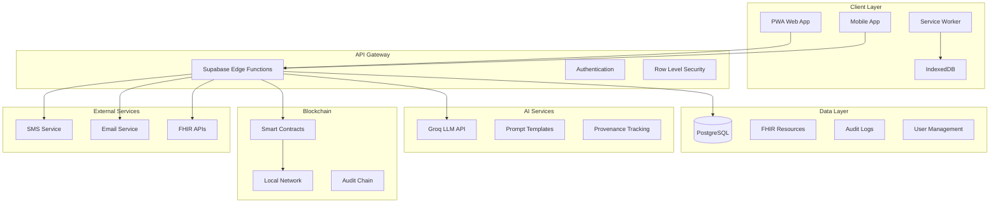
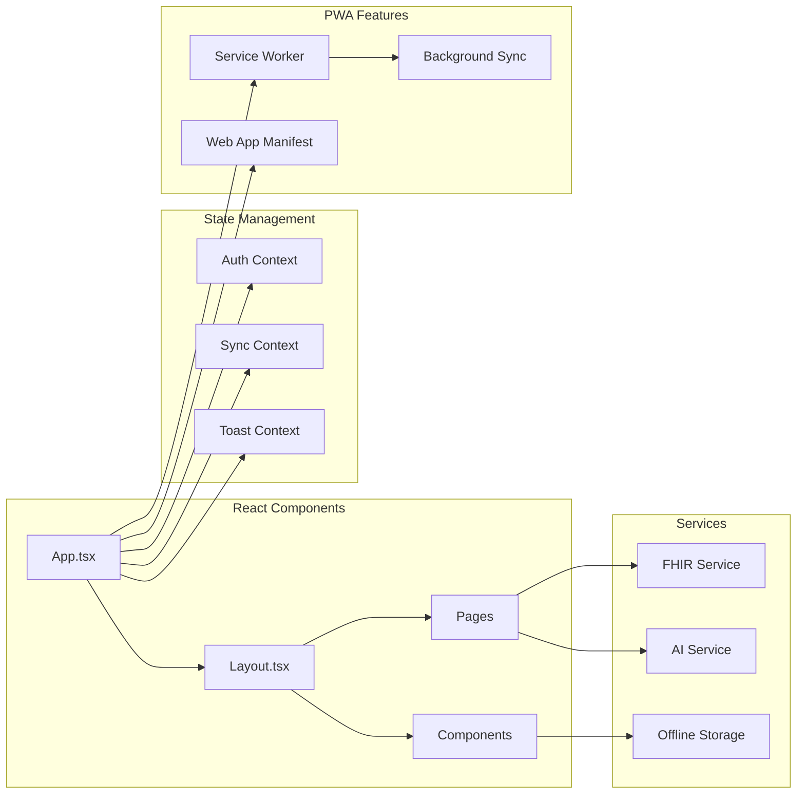
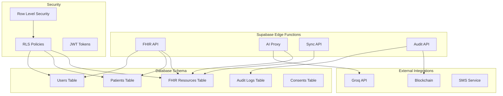
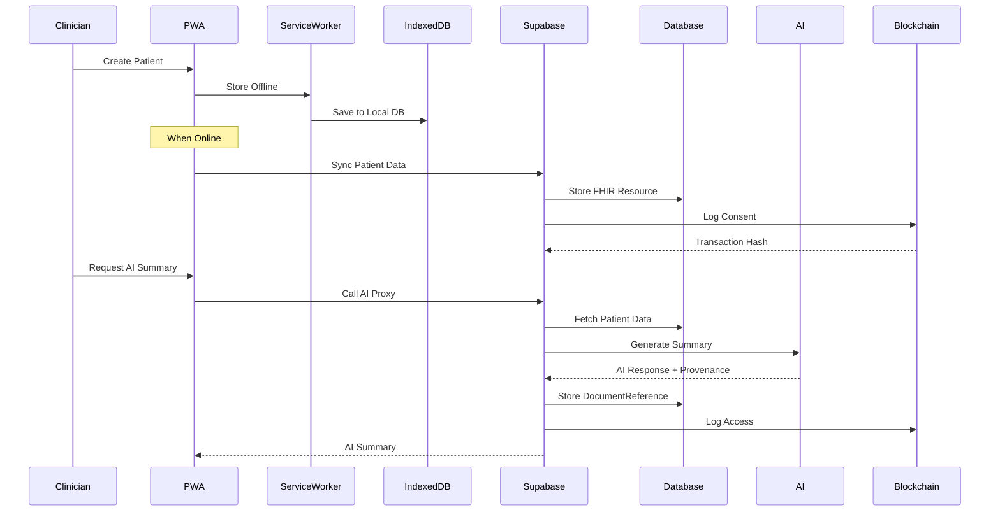
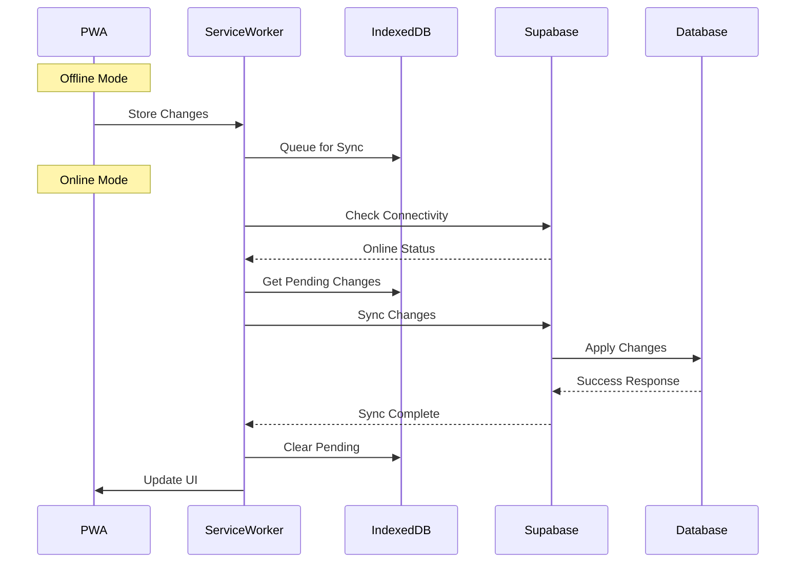
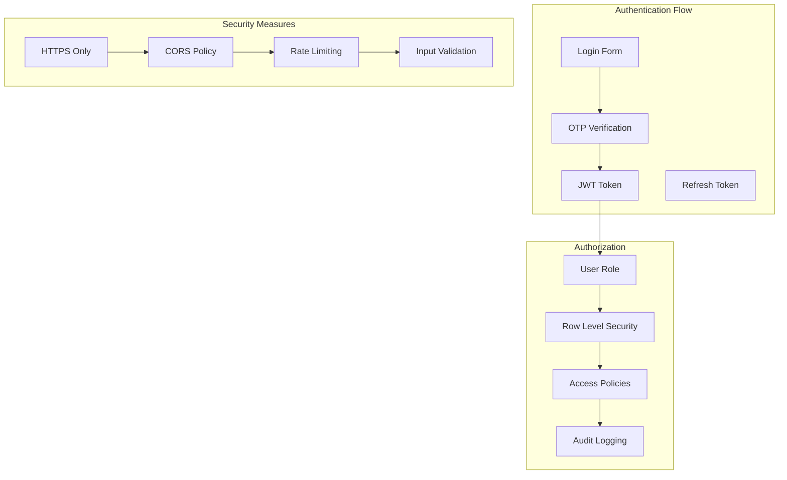
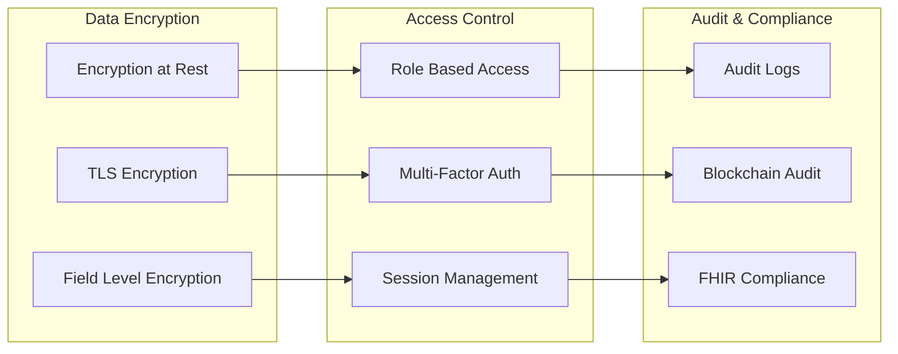

# Medflect AI Architecture

## Overview

Medflect AI is a comprehensive healthcare PWA that combines modern web technologies with AI-powered insights, FHIR R4 compliance, and blockchain-based audit trails. The system is designed with offline-first capabilities, ensuring healthcare providers can continue working even when connectivity is limited.

## System Architecture

## Component Architecture

### Frontend (PWA)

### Backend Services

## Data Flow

### Patient Data Flow

### Offline Sync Flow

## Security Architecture

### Authentication & Authorization

### Data Protection

## Technology Stack

### Frontend
- **Framework**: React 18 with TypeScript
- **Build Tool**: Vite
- **Styling**: TailwindCSS + ShadCN/Radix UI
- **State Management**: React Context + Hooks
- **Routing**: React Router v6
- **PWA**: Workbox + Service Worker
- **Offline Storage**: IndexedDB + localforage

### Backend
- **Platform**: Supabase (PostgreSQL + Edge Functions)
- **Database**: PostgreSQL 15 with JSONB support
- **Authentication**: Supabase Auth with JWT
- **API**: RESTful APIs with FHIR compliance
- **Security**: Row Level Security (RLS)

### AI & External Services
- **LLM**: Groq API with custom prompts
- **Blockchain**: Ethereum smart contracts (Hardhat)
- **SMS**: Twilio/Africa's Talking integration
- **Email**: Supabase built-in email service

### Development & Deployment
- **Package Manager**: npm workspaces
- **Containerization**: Docker + Docker Compose
- **CI/CD**: GitHub Actions
- **Testing**: Jest + React Testing Library
- **Linting**: ESLint + Prettier

## Performance Considerations

### PWA Optimization
- Service Worker caching strategies
- Lazy loading of components
- Code splitting with dynamic imports
- Optimized bundle sizes
- Background sync for offline operations

### Database Optimization
- Indexed JSONB columns for FHIR queries
- Connection pooling
- Query optimization with proper indexes
- Read replicas for scaling

### AI Response Optimization
- Prompt template caching
- Response streaming for long summaries
- Fallback to cached responses
- Rate limiting and cost optimization

## Scalability

### Horizontal Scaling
- Supabase auto-scaling capabilities
- Edge Functions distributed globally
- CDN for static assets
- Load balancing for high traffic

### Vertical Scaling
- Database instance upgrades
- Memory and CPU optimization
- Connection pool tuning
- Cache layer implementation

## Monitoring & Observability

### Application Metrics
- Performance monitoring (Core Web Vitals)
- Error tracking and alerting
- User behavior analytics
- API response times

### Infrastructure Metrics
- Database performance
- Edge Function execution times
- Blockchain transaction monitoring
- External API health checks

### Audit Trail
- Comprehensive logging
- Blockchain-based audit trail
- Compliance reporting
- Data lineage tracking

## Disaster Recovery

### Backup Strategy
- Automated database backups
- Point-in-time recovery
- Cross-region replication
- Offline data backup

### Business Continuity
- Multi-region deployment
- Failover procedures
- Data recovery processes
- Communication protocols

## Compliance & Governance

### FHIR Compliance
- FHIR R4 resource validation
- Standard FHIR operations
- Extensions for custom fields
- Terminology binding

### Healthcare Regulations
- HIPAA compliance measures
- Data privacy protection
- Consent management
- Audit trail requirements

### Blockchain Governance
- Smart contract upgrades
- Multi-signature requirements
- Governance token mechanisms
- Community voting systems 